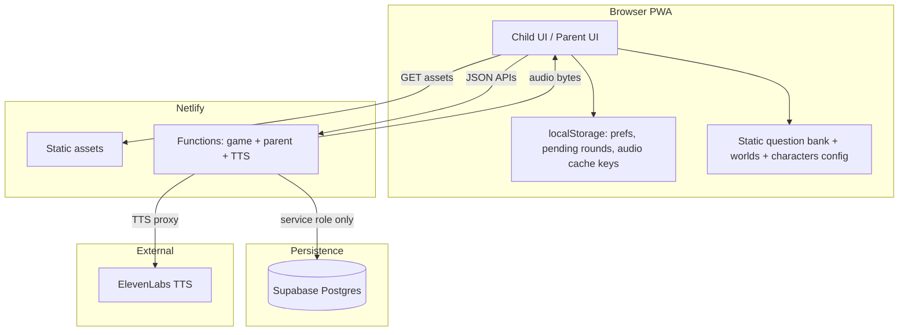

# Design Director Packet — Island Quest v1

| Field | Value |
|-------|--------|
| **Mission ID** | d968e79b |
| **Role** | Design Director (architecture & contracts only; no application source) |
| **Date** | 2026-07-30 |
| **Product** | Island Quest — family trivia PWA for two children |
| **Risk class** | Level 2 (children’s product, voice secrets, parent PIN, remote scores) |
| **Governing brief** | `../KIds Productivity game brief.txt` §1–40 |
| **Workflow** | GLOBAL AGENTIC BUILD SYSTEM v1.1 |
| **Standards** | Carl `AGENT_STANDARDS.md` |
| **Mission** | `docs/MISSION.md` |
| **Status doc** | `WORKING.md` |

**Authority of this packet:** Source of truth for domain model, scoring integrity, persistence choice, API contracts, content strategy, and security boundaries for Dev Director phase planning and Challenger review. Does not authorise code, deploy, or acceptance.

---

## 1. Problem restatement (game-first, not school)

**Problem to solve:** Two siblings (≈7 and ≈10) living on Gili Meno need a reason to voluntarily open a short knowledge game, compete fairly across different ability levels, and earn parent-defined weekly prizes—without the product looking or feeling like homework, LMS, or assessment.

**Visible product:** Competition, characters, points, worlds, power-ups, comic wrong-answer feedback, weekly leaderboard, voice guide, unlocks.

**Hidden product:** Age-adjusted trivia, explanations, local ocean/Indonesia knowledge, consistency rewards, rematch of misses (as “Revenge Round,” never “revision”).

**Non-problems for v1:** Public multiplayer, chat, payments, school accounts, AI open tutoring, generative questions without review, native apps.

**Success test (brief §39):** Would a 7- or 10-year-old open this because it looks fun? Can James see who played, totals, and this week’s reward in ~30 seconds?

**Design principle:** Game language only in child UI (Quest, World, Hit/Miss, Rank, Adventure Progress). No “lesson / homework / grade / failed / remedial.”

---

## 2. System architecture

### 2.1 Logical architecture (ASCII)

```
┌─────────────────────────────────────────────────────────────────────────┐
│                         CHILD / PARENT BROWSER (PWA)                      │
│  React + TS + Vite │ local state (round draft) │ localStorage (prefs,     │
│  offline queue, audio cache index) │ never secrets / never VITE_ secrets  │
└────────────┬───────────────────────────────┬────────────────────────────┘
             │ HTTPS JSON / audio            │
             ▼                               ▼
┌────────────────────────────┐   ┌────────────────────────────────────────┐
│   Netlify CDN (static SPA) │   │         Netlify Functions              │
│   dist/ + SPA redirect     │   │  start-round │ complete-round          │
│   questions JSON (public   │   │  leaderboard │ players │ rewards       │
│   bank; no secrets)        │   │  text-to-speech │ parent-auth          │
│                            │   │  admin/* (PIN-gated)                   │
└────────────────────────────┘   └───────┬──────────────────┬─────────────┘
                                         │                  │
                    server-only secrets  │                  │ allowlisted
                    PARENT_PIN_HASH      │                  │ voice IDs +
                    SESSION_SECRET       │                  │ rate limit
                    SUPABASE_SERVICE_KEY │                  ▼
                                         ▼           ┌──────────────┐
                              ┌──────────────────┐   │  ElevenLabs  │
                              │ Supabase Postgres│   │  TTS API     │
                              │ (authoritative)  │   └──────────────┘
                              │ players, rounds, │
                              │ attempts, weeks, │
                              │ rewards, sessions│
                              └──────────────────┘
```

### 2.2 Mermaid



### 2.3 Trust boundaries

| Zone | Trust | May hold |
|------|--------|----------|
| Browser | Untrusted | Display names, answers chosen, UI prefs, pending queue |
| Static host | Public | Question text bank, art, SFX (no keys) |
| Netlify Functions | Trusted compute | Score math, PIN verify, ElevenLabs key, DB service role |
| Supabase | Authoritative store | Progress, rounds, leaderboard, reward config, PIN hash, sessions |
| ElevenLabs | External vendor | Transient TTS text only (no child PII beyond spoken content) |

**Rule:** Client submits *answers and events*; server computes *scores and leaderboard deltas*. Client-supplied `score`, `xp`, `coins`, or `weeklyPoints` are ignored.

### 2.4 Component ownership (for Dev Director)

| Component | Owner phase | Notes |
|-----------|-------------|--------|
| Domain types + Zod schemas | Shared contract | Single source; Builder must not diverge |
| `GameRepository` interface | Design (this doc) / Dev implements | One adapter in v1 |
| Scoring / weekId / selection pure modules | Core engine | Unit-tested, no I/O |
| Netlify Functions | API boundary | All mutations |
| Static config (characters, worlds) | Content/config | No secrets in character `voiceId` resolution client-side—map server-side by character `id` |

---

## 3. Domain model (TypeScript-shaped types)

Canonical types for Dev Director and Builder. All dates ISO-8601 UTC strings unless noted. IDs are opaque strings (`pl_`, `q_`, `rnd_`, `att_`, etc. prefixes recommended).

```ts
/** --- Identity & progression --- */

type DifficultyLevel = 1 | 2 | 3 | 4;

type AgeBand = "6-7" | "8-9" | "10-11" | "advanced";

type Player = {
  id: string;
  displayName: string;           // nickname only; no legal name required
  birthYear?: number;            // optional; prefer ageBand
  ageBand: AgeBand;
  difficultyLevel: DifficultyLevel;
  avatarId: string;
  guideCharacterId: string;
  xp: number;                    // lifetime progression
  level: number;                 // derived or stored; server may recompute
  coins: number;                 // cosmetic currency only
  currentStreak: number;         // consecutive correct across answers (server-authoritative)
  longestStreak: number;
  enabled: boolean;
  createdAt: string;
  updatedAt: string;
};

/** --- Content --- */

type QuestionStatus = "draft" | "reviewed" | "active" | "retired";

type QuestionType = "multiple-choice" | "true-false" | "image-choice";

type AnswerOption = {
  id: string;
  text: string;
  image?: string;                // public path under /public
};

type Question = {
  id: string;
  status: QuestionStatus;
  type: QuestionType;
  category: string;              // internal knowledge category
  subcategory?: string;
  worldId: string;               // visible world mapping
  difficulty: DifficultyLevel;
  minimumAge?: number;
  maximumAge?: number;
  question: string;
  shortQuestion?: string;
  answers: AnswerOption[];
  correctAnswerId: string;       // must match exactly one answers[].id
  explanation: string;           // shown after answer; required
  funFact?: string;
  hint?: string;                 // for Ask the Guide
  image?: string;
  sourceName?: string;
  sourceUrl?: string;
  licence?: string;
  tags: string[];
  timeLimitMs?: number;          // default from difficulty if omitted
  createdAt: string;
  reviewedAt?: string;
};

/** --- Round lifecycle --- */

type RoundMode =
  | "quick-play"
  | "world-quest"
  | "daily-challenge"
  | "boss-battle"
  | "rematch";

type PowerUpId =
  | "fifty-fifty"
  | "extra-time"
  | "ask-guide"
  | "double-treasure"
  | "second-chance"
  | "shield";

type RoundStatus = "started" | "completed" | "abandoned" | "rejected";

/** Server-created when start-round succeeds */
type Round = {
  id: string;                    // server-generated; client must echo
  playerId: string;
  mode: RoundMode;
  worldId?: string;
  weekId: string;                // Asia/Makassar week key
  difficultyLevel: DifficultyLevel; // snapshot of player level at start
  questionIds: string[];         // ordered; server-selected
  powerUpsGranted: PowerUpId[];  // inventory for this round
  powerUpsRemaining: Partial<Record<PowerUpId, number>>;
  status: RoundStatus;
  startedAt: string;
  expiresAt: string;             // abandon if not completed
  completedAt?: string;
};

/** Client event per question; score not accepted from client */
type AttemptInput = {
  questionId: string;
  selectedAnswerId: string | null; // null = timeout / skip
  responseTimeMs: number;          // clamped server-side
  powerUpsUsed: PowerUpId[];       // order of use on this question
  secondChanceSelectedAnswerId?: string;
};

/** Server-persisted attempt with verified outcome */
type Attempt = {
  id: string;
  roundId: string;
  playerId: string;
  questionId: string;
  selectedAnswerId: string | null;
  correct: boolean;
  responseTimeMs: number;
  powerUpsUsed: PowerUpId[];
  basePoints: number;
  speedBonus: number;
  streakBonus: number;
  powerUpMultiplier: number;     // 1 or 2
  pointsAwarded: number;         // final for this question
  attemptedAt: string;
};

type CompletedRoundResult = {
  round: Round;
  attempts: Attempt[];
  correctCount: number;
  score: number;                 // sum of pointsAwarded (weekly points delta)
  xpEarned: number;
  coinsEarned: number;
  durationMs: number;
  streakAfter: number;
  bonuses: {
    firstRoundOfDay: number;
    dailyChallenge: number;
    perfectRound: number;
    rematchRecovery: number;
  };
  achievementsUnlocked: string[];
  leaderboard: WeeklyLeaderboardEntry;
};

/** --- Competition --- */

/** weekId format: `YYYY-Www` where week starts Monday 00:00 Asia/Makassar */
type WeekId = string;

type WeeklyLeaderboardEntry = {
  playerId: string;
  weekId: WeekId;
  points: number;
  questsCompleted: number;
  correctAnswers: number;
  dailyChallengesCompleted: number;
  bestStreak: number;            // best in-week streak snapshot
  achievementIds: string[];      // end-of-week titles when archived
  updatedAt: string;
};

type WeeklyLeaderboard = {
  weekId: WeekId;
  timezone: "Asia/Makassar";
  startsAt: string;              // ISO instant of Mon 00:00 Makassar
  endsAt: string;                // ISO instant of next Mon 00:00 (exclusive)
  entries: WeeklyLeaderboardEntry[]; // sorted by points desc, then questsCompleted desc
};

type WeeklyTitleId =
  | "weekly-champion"
  | "best-streak"
  | "most-improved"
  | "quest-explorer"
  | "comeback-star"
  | "fact-finder";

type EndOfWeekAwards = {
  weekId: WeekId;
  awards: Array<{
    titleId: WeeklyTitleId;
    playerId: string;
    metricValue: number;
    label: string;               // game language, never "loser"
  }>;
  archivedAt: string;
};

/** --- Rewards --- */

type WeeklyReward = {
  id: string;
  weekId: WeekId;
  participationReward: string;   // parent free text only
  championBonus?: string;
  minimumQuests: number;
  enabled: boolean;
  updatedAt: string;
};

type Reward = {
  // Lifetime / cosmetic unlocks (v1 lightweight)
  id: string;
  playerId: string;
  kind: "badge" | "frame" | "title" | "cosmetic" | "power-up-grant";
  refId: string;
  earnedAt: string;
  weekId?: WeekId;
};

/** --- Guide --- */

type GuidePersonality = "calm" | "funny" | "adventurous" | "energetic";

type GuideCharacter = {
  id: string;                    // e.g. "captain-coral"
  name: string;
  description: string;
  /** Client never stores ElevenLabs voice UUID; server maps id → env voice */
  voiceKey: string;              // maps to ELEVENLABS_*_VOICE_ID env
  image: string;
  previewText: string;
  personality: GuidePersonality;
  enabled: boolean;
};

/** --- Power-ups (config + runtime) --- */

type PowerUpDefinition = {
  id: PowerUpId;
  name: string;
  description: string;
  maxPerRound: number;
  /** Whether use must be registered before answer submit */
  timing: "before-answer" | "on-wrong" | "either";
};

type PowerUpInventory = Partial<Record<PowerUpId, number>>;

/** --- Achievements --- */

type AchievementConditionType =
  | "quests_completed"
  | "streak"
  | "perfect_rounds"
  | "daily_challenge_days"
  | "category_correct"
  | "weekly_title";

type Achievement = {
  id: string;
  name: string;
  description: string;
  icon: string;
  conditionType: AchievementConditionType;
  threshold: number;
  repeatable: boolean;
};

type PlayerAchievement = {
  achievementId: string;
  playerId: string;
  unlockedAt: string;
  weekId?: WeekId;
};

/** --- Mastery (internal; never "weak" language in UI) --- */

type CategoryProgress = {
  playerId: string;
  categoryId: string;
  attempted: number;
  correct: number;
  masteryScore: number;          // 0–1 deterministic
  lastPlayedAt: string;
};

/** --- Parent session --- */

type ParentSession = {
  tokenHash: string;
  createdAt: string;
  expiresAt: string;
  lastSeenAt: string;
};
```

### 3.1 Default seed players (v1 family)

| Slot | displayName | difficultyLevel | ageBand | Notes |
|------|-------------|-----------------|---------|--------|
| Player A | (parent-configurable; e.g. older) | 3 | 10-11 | Higher base points per correct |
| Player B | (parent-configurable; e.g. younger) | 1 | 6-7 | Longer default timers |

Exact names are parent-editable; no real-world identity required.

### 3.2 Default timer by difficulty (if question omits `timeLimitMs`)

| Level | Default timeLimitMs |
|-------|---------------------|
| 1 | 30000 |
| 2 | 25000 |
| 3 | 20000 |
| 4 | 18000 |

Extra Time power-up: +10000 ms to that question’s limit (server records granted limit at answer time via client-reported limit? **No** — client sends `responseTimeMs` only; Extra Time is validated as used and speed bonus uses `timeLimitMs + 10000` if Extra Time in `powerUpsUsed`).

---

## 4. Scoring integrity

### 4.1 Principle

1. Client never submits a total score that is trusted.
2. `POST complete-round` body is an *event log*; server recomputes everything.
3. Duplicate `roundId` → reject (`ROUND_ALREADY_COMPLETED`).
4. Unknown / retired / draft questions in submission → reject.
5. Answers not in option set → incorrect (not 500).
6. Power-up use must be subset of remaining inventory; overuse → reject or ignore illegal uses (prefer **reject entire submission** for integrity simplicity).

### 4.2 Submission payload (conceptual)

```ts
type CompleteRoundRequest = {
  roundId: string;
  playerId: string;
  attempts: AttemptInput[];
  clientCompletedAt: string;     // advisory only
};
```

### 4.3 Server algorithm (normative)

Pure function signature:

```ts
function scoreRound(
  round: Round,
  questions: Map<string, Question>,
  attempts: AttemptInput[],
  player: Player,
  context: {
    weekId: WeekId;
    isFirstCompletedRoundOfLocalDay: boolean;
    now: Date;
  }
): CompletedRoundResult
```

#### Step A — Structural validation

1. `round.status === "started"` and `round.playerId === playerId`.
2. `now <= round.expiresAt` (else abandon; no score).
3. `attempts.length === round.questionIds.length`.
4. Each `attempts[i].questionId === round.questionIds[i]` (order fixed; no reordering).
5. Each `responseTimeMs` clamped to `[0, 120_000]`.
6. Power-up multiset across attempts ⊆ granted inventory and respects `maxPerRound`.

#### Step B — Per-question scoring

Constants:

```ts
const BASE: Record<DifficultyLevel, number> = {
  1: 100,
  2: 125,
  3: 150,
  4: 200,
};

const SPEED_BONUS_MAX = 50;
const STREAK_STEP = 25;
const STREAK_BONUS_MAX = 100;

const FIRST_ROUND_OF_DAY = 100;
const DAILY_CHALLENGE_COMPLETE = 250;
const PERFECT_ROUND = 300;
const REMATCH_RECOVERY = 50; // if mode === rematch and correctCount >= 1
```

State during loop:

- `streak` starts at `player.currentStreak` at round start snapshot? **Decision:** streak is **within-round consecutive correct** for streak *bonus*, but `player.currentStreak` is **cross-session** updated at end: if last attempt of round correct, continue lifetime streak; if any incorrect without Shield, break at that point.

**Clarified streak rules:**

| Concept | Definition |
|---------|------------|
| Lifetime streak (`player.currentStreak`) | Consecutive correct answers across completed attempts; broken by incorrect without Shield |
| Streak bonus (per correct answer) | Based on consecutive correct *so far in this round only*: after N consecutive correct in round, bonus = `min(100, 25 * (N - 1))` i.e. 0 on first, 25 on second, … |

For each attempt in order:

1. Load `Q`. Determine effective correct:
   - If `fifty-fifty` used: no score change; only reduces options client-side (server ignores which were hidden).
   - If `second-chance` used: if first `selectedAnswerId` wrong and `secondChanceSelectedAnswerId` correct → `correct = true`, **no speed bonus**, base points only, streak continues.
   - Else if `selectedAnswerId === Q.correctAnswerId` → correct.
   - Timeout / null → incorrect.
2. **Shield:** if incorrect and `shield` in powerUpsUsed for this question → lifetime streak not broken; no points; streak bonus N/A.
3. If correct:
   - `base = BASE[Q.difficulty]` (use **question** difficulty, not player level — fair competition)
   - `limit = (Q.timeLimitMs ?? defaultFor(player.difficultyLevel)) + (extra-time ? 10000 : 0)`
   - `speedBonus = floor(SPEED_BONUS_MAX * max(0, 1 - responseTimeMs / limit))` (0 if second-chance recovery)
   - `streakBonus` as table above
   - `mult = double-treasure ? 2 : 1`
   - `pointsAwarded = (base + speedBonus + streakBonus) * mult`
4. If incorrect (and not shielded streak-only case): `pointsAwarded = 0`; break lifetime streak unless Shield.

**Ask the Guide:** no point change; may be rate-limited; hint text from `Q.hint` or truncated explanation—server may return hint only via optional endpoint; TTS may speak it.

#### Step C — Round bonuses (added once to score)

```
roundScore = sum(pointsAwarded)
if context.isFirstCompletedRoundOfLocalDay: roundScore += 100
if round.mode === "daily-challenge" && correctCount >= 1: roundScore += 250
   // Decision: bonus for completing the daily, not only perfect
if correctCount === attempts.length && attempts.length > 0: roundScore += 300
if round.mode === "rematch" && correctCount >= 1: roundScore += 50
```

Local day = calendar date in `Asia/Makassar`.

#### Step D — XP and coins (server)

```
xpEarned = correctCount * 10 + (perfect ? 50 : 0) + (mode daily-challenge ? 25 : 0)
coinsEarned = correctCount * 5 + (perfect ? 20 : 0)
```

Not used for leaderboard ranking. Cosmetic / progression only.

#### Step E — Persist transaction (single logical unit)

1. Insert attempts + mark round completed.
2. Update player xp, coins, streaks, level (level thresholds: `level = 1 + floor(xp / 500)`, cap later).
3. Upsert `WeeklyLeaderboardEntry`: `points += roundScore`, `questsCompleted += 1`, etc.
4. Update category progress.
5. Evaluate achievements.
6. Return verified `CompletedRoundResult`.

#### Step F — Idempotency

- Primary key / unique on `rounds.id`.
- Second complete → `409 ROUND_ALREADY_COMPLETED` with original result if available (read-only replay).

### 4.4 What client may show optimistically

Client may animate a *provisional* score for UX, then **reconcile** to server result. UI must not claim leaderboard rank until server confirms. If server differs, snap to server and show subtle “Score verified” (game language).

---

## 5. Difficulty / fair competition model

### 5.1 Levels

| Level | Approx ages | Base correct pts | Default timer | Question language |
|-------|-------------|------------------|---------------|-------------------|
| 1 | 6–7 | 100 | 30s | Short, simple vocab |
| 2 | 8–9 | 125 | 25s | Moderate |
| 3 | 10–11 | 150 | 20s | Advanced vocab / facts |
| 4 | Challenge | 200 | 18s | Harder facts / multi-step |

### 5.2 Fairness mechanism (normative)

1. **Normalised leaderboard points** use **question difficulty base**, not “number correct.”
2. Younger child on L1 can match older child on L3 via consistency, streaks, dailies, perfect rounds, rematch bonuses.
3. **Do not** put both children on identical question sets when levels differ.
4. **Do not** display “you got easier questions” in child UI.
5. Parent may reassign `difficultyLevel` (admin API).

### 5.3 Expected points per standard 10-question round (order-of-magnitude)

| Profile | Typical raw correct | Typical weekly points range (no power-ups) |
|---------|---------------------|--------------------------------------------|
| L1 solid | 7–9 | ~700–1200 + bonuses |
| L3 solid | 7–9 | ~1050–1600 + bonuses |

Balances so L1 with higher consistency/dailies can lead week. **No ML.**

---

## 6. Weekly leaderboard (Asia/Makassar Mon–Sun)

### 6.1 Week identity

- Timezone: **`Asia/Makassar`** (UTC+8, no DST).
- Week starts: **Monday 00:00:00** Makassar.
- Week ends: exclusive **next Monday 00:00:00** Makassar (display as Sunday end-of-day to humans).
- `weekId` algorithm (deterministic):

```
// Pseudocode — implement with a TZ-aware library (e.g. Temporal or luxon)
local = toZonedTime(now, "Asia/Makassar")
monday = startOfWeek(local, { weekStartsOn: 1 })
weekId = `${monday.year}-W${pad(isoWeekNumber(monday), 2)}`
// Also store startsAt/endsAt ISO instants for display countdown
```

**Decision:** Use ISO week number **in Asia/Makassar calendar**, Monday-based. Document edge cases around year boundaries in unit tests (e.g. 2025-12-29 → week of 2025 or 2026 per ISO rules applied on Makassar date).

### 6.2 Ranking

Sort entries:

1. `points` DESC  
2. `questsCompleted` DESC  
3. `correctAnswers` DESC  
4. `playerId` ASC (stable)

### 6.3 Healthy competition copy (contracts for UX)

Forbidden in UI strings: loser, failed, worst, dumb, behind forever.  
Required end-of-week multi-title set (both children can win something):

| titleId | Rule (deterministic) |
|---------|----------------------|
| `weekly-champion` | Highest `points` (tie → more quests, then more correct) |
| `best-streak` | Highest `bestStreak` in week |
| `most-improved` | Largest `(points_this_week - points_prev_week)`; if no prev week, skip or award higher quests growth |
| `quest-explorer` | Highest `questsCompleted` |
| `comeback-star` | Largest single-round score while rank was 2nd at start of that day (if only 2 players: highest score on a day after trailing) — **simplify v1:** player with highest single-round `score` who was not weekly-champion |
| `fact-finder` | Highest `correctAnswers` |

Awards computed on **first read after `endsAt`** or via `weekly-rollover` function; archived into `end_of_week_awards` table; new week entries created lazily on first activity.

### 6.4 Rollover

- **Lazy rollover (preferred v1):** any `leaderboard` or `complete-round` call computes `currentWeekId(now)`; if request week is past and awards missing, archive titles once (idempotent).
- Optional scheduled `weekly-rollover` Netlify function for pre-computation—not required if lazy is correct.

Parent may **reset week** (admin): zeros current week entries for all players; audit log entry required.

---

## 7. Question selection algorithm (deterministic, no ML)

### 7.1 Inputs

```ts
type SelectRoundInput = {
  player: Player;
  mode: RoundMode;
  worldId?: string;
  count: number;                 // 5 or 10
  now: Date;
  recentQuestionIds: string[];   // last N days from attempts; exclude same local day
  weakCategoryIds: string[];     // lowest masteryScore; internal
  enabledCategories: string[];   // parent toggles
  rngSeed: string;               // roundId or hash(playerId|weekId|mode|day|nonce)
};
```

### 7.2 Count by mode

| Mode | Questions |
|------|-----------|
| quick-play | 5 |
| world-quest | 10 |
| daily-challenge | 5 |
| boss-battle | 10 |
| rematch | min(5, available misses) |

### 7.3 Pool filters

From questions where `status === "active"`:

1. `difficulty` in allowed set (below).
2. Category in `enabledCategories` (default all).
3. Mode world-quest: `worldId` match.
4. Exclude IDs in `recentQuestionIds` (same local day always; prefer exclude last 7 days).
5. Rematch: only previously incorrect for this player (lifetime or last 30 days—**v1: last 30 days**).

### 7.4 Composition (10-question standard / world / boss)

Let `L = player.difficultyLevel`:

| Slot count | Difficulty target |
|------------|-------------------|
| 5 | `L` |
| 2 | `max(1, L - 1)` |
| 2 | `min(4, L + 1)` |
| 1 | weak-area category at difficulty `L` (or rematch miss if available) |

For **5-question** modes: `3 × L`, `1 × L-1`, `1 × L+1` (clamp 1–4).

**Daily challenge:** fixed set per `(playerId, localDate)`:

```
seed = hash(`${playerId}|${localDate}|daily-v1`)
select deterministically with seed from mixed categories at composition above
```

Same child same day always same 5 until completed (store `daily_challenge` row).

### 7.5 Deterministic pick

Within each slot’s filtered pool:

1. Sort by `id` ASC.
2. Choose `index = hash32(seed + slotIndex) % pool.length`.
3. Remove chosen id from all pools (no duplicates in round).
4. If pool empty, relax: (a) allow recent 7-day, (b) any difficulty adjacent, (c) any active—never crash; log `selection_relaxed`.

### 7.6 Server ownership

**`start-round` performs selection.** Client does not choose question IDs (except rematch may request mode only). Prevents cherry-picking easy IDs.

---

## 8. Persistence: GameRepository + v1 store choice

### 8.1 Interface (expanded, v1-complete)

```ts
interface GameRepository {
  // Players
  listPlayers(): Promise<Player[]>;
  getPlayer(id: string): Promise<Player | null>;
  updatePlayer(id: string, patch: Partial<Player>, opts?: { admin: true }): Promise<Player>;

  // Rounds
  createRound(round: Omit<Round, "status"> & { status: "started" }): Promise<Round>;
  getRound(id: string): Promise<Round | null>;
  completeRound(result: CompletedRoundResult): Promise<CompletedRoundResult>; // transactional

  // History
  listAttemptsForPlayer(playerId: string, since: string): Promise<Attempt[]>;
  listRecentQuestionIds(playerId: string, since: string): Promise<string[]>;
  getCategoryProgress(playerId: string): Promise<CategoryProgress[]>;
  upsertCategoryProgress(rows: CategoryProgress[]): Promise<void>;

  // Leaderboard & weeks
  getLeaderboard(weekId: WeekId): Promise<WeeklyLeaderboard>;
  upsertLeaderboardEntry(entry: WeeklyLeaderboardEntry): Promise<void>;
  getEndOfWeekAwards(weekId: WeekId): Promise<EndOfWeekAwards | null>;
  saveEndOfWeekAwards(awards: EndOfWeekAwards): Promise<void>;
  resetWeek(weekId: WeekId): Promise<void>;

  // Rewards
  getWeeklyReward(weekId: WeekId): Promise<WeeklyReward | null>;
  upsertWeeklyReward(reward: WeeklyReward): Promise<void>;

  // Achievements
  listPlayerAchievements(playerId: string): Promise<PlayerAchievement[]>;
  grantAchievement(row: PlayerAchievement): Promise<void>;

  // Daily challenge lock
  getDailyChallenge(playerId: string, localDate: string): Promise<{ questionIds: string[]; completed: boolean } | null>;
  saveDailyChallenge(playerId: string, localDate: string, questionIds: string[]): Promise<void>;

  // Parent auth
  getParentPinHash(): Promise<string | null>;
  createParentSession(tokenHash: string, expiresAt: string): Promise<void>;
  getParentSession(tokenHash: string): Promise<ParentSession | null>;
  touchParentSession(tokenHash: string, lastSeenAt: string): Promise<void>;
  revokeParentSession(tokenHash: string): Promise<void>;

  // Admin audit (minimal)
  appendAudit(event: { type: string; at: string; meta: Record<string, string | number | boolean> }): Promise<void>;
}
```

### 8.2 Recommended v1 store: **Supabase Postgres (service role only)**

| Option | Pros | Cons | Verdict |
|--------|------|------|---------|
| **Supabase Postgres** | Relational integrity, unique constraints on `round_id`, SQL aggregates, free tier, mature Netlify patterns | Extra vendor; must never expose service role to browser | **SELECTED** |
| Neon Postgres | Excellent serverless Postgres | Similar work; fewer batteries; still need auth patterns for sessions | Rejected for v1 (near-tie; switch later via repository) |
| Netlify Blobs | Same platform, zero DB | Weak concurrent complete-round, awkward leaderboard/query, easy to corrupt family competition | Rejected for authoritative scores |

**Rationale:** Authoritative multi-writer-safe scoring and weekly competition for a children’s product need unique constraints and transactional updates. Blobs optimise convenience over integrity. Repository interface allows swap later without UI rewrite.

**Access rules:**

- Only Netlify Functions use `SUPABASE_URL` + `SUPABASE_SERVICE_ROLE_KEY`.
- No Supabase client in browser for game writes.
- RLS optional hardening: still use service role from functions; do not rely on anon key for v1 family app.
- Migrations: SQL files versioned in repo; additive-only unless Carl approves.

### 8.3 Minimal tables (logical)

`players`, `rounds`, `attempts`, `weekly_leaderboard`, `weekly_rewards`, `end_of_week_awards`, `category_progress`, `player_achievements`, `daily_challenges`, `parent_sessions`, `audit_log`, `app_secrets` (or env-only for PIN hash).

**Questions:** live as **versioned static JSON in repo** (`src/data/questions/**`) for v1 reviewability and CI validation—not in DB. Server loads same bank as client for scoring (or server-only copy). **Decision:** ship question bank in repo; functions import/read the same JSON artifact built into the function bundle. Parent “edit questions” in v1 is **optional / out of critical path**—retire via status in JSON + redeploy, or thin admin later.

---

## 9. ElevenLabs boundary

### 9.1 Contract

```
POST /.netlify/functions/text-to-speech
Content-Type: application/json
```

**Request:**

```ts
type TtsRequest = {
  text: string;                  // max 500 chars after trim
  characterId: string;           // GuideCharacter.id — NOT raw ElevenLabs voice UUID from client
  context: "preview" | "question" | "explanation" | "reaction" | "welcome" | "results";
};
```

**Response success:** `200` with `Content-Type: audio/mpeg` (or provider format), body = audio bytes.  
Headers: `X-Request-Id`, `X-Cache: HIT|MISS`.

**Response error:** JSON error envelope (§12).

### 9.2 Server steps

1. Parse + Zod validate.
2. Reject if `text.length > 500` or empty.
3. Strip control chars; reject if URL-like spam / excessive repetition.
4. Map `characterId` → allowlisted env voice id; reject unknown / disabled character.
5. Rate limit: **30 req / IP / 10 min** and **60 req / player cookie-or-header / 10 min** (family-scale; prevent bill shock).
6. Cache key: `sha256(`${voiceId}|${normalisedText}|${modelId}`)` — memory or Netlify Blobs audio cache optional; **v1 minimum:** in-function response cache not required if CDN short cache on GET alternative—**Decision:** implement **hash-keyed Blobs or filesystem-less memory per instance + Cache-Control on response** for identical text/voice; document best-effort.
7. Call ElevenLabs with server `ELEVENLABS_API_KEY` + `ELEVENLABS_MODEL_ID`.
8. On provider failure: `503 VOICE_UNAVAILABLE` (no provider body leak).

### 9.3 Client duties

- Never send API key.
- Always show question text; voice is enhancement.
- Mute / stop on navigation; no overlapping playback.
- On failure: play continues; subtle “Voice unavailable”; retry control.
- Pre-generated optional assets for common reactions in `/public/sounds` to cut API use.

### 9.4 Failure modes

| Failure | User effect | System |
|---------|-------------|--------|
| Missing API key | Silent degrade | Log once; 503 |
| Rate limit | Soft message | 429 |
| Invalid characterId | No audio | 400 |
| Provider 5xx/timeout | Degrade | 503; no block on round |
| Network offline | Degrade | Client skip call |

---

## 10. Parent PIN / admin trust boundary

### 10.1 Model

- **Not** child security against each other (siblings will share devices).
- **Is** friction against casual child access to rewards/settings + basic integrity for admin mutations.
- Four- to six-digit PIN → **bcrypt/scrypt/argon2 hash** in env `PARENT_PIN_HASH` (or DB). Never store plaintext PIN.
- **Arithmetic gate is forbidden** as sole gate.

### 10.2 Session

```
POST parent-auth { pin: string }
→ { token: string, expiresAt: string }  // opaque random 32+ bytes
```

- Server stores only `sha256(token)` in `parent_sessions`.
- TTL: **30 minutes** idle; absolute max **4 hours**.
- Admin routes require `Authorization: Bearer <token>`.
- Rate limit PIN attempts: **5 / 15 min / IP**; lockout message without confirming PIN existence details.

### 10.3 Admin capabilities (PIN session required)

- Set weekly reward text + minimum quests  
- Bonus points (±) with audit  
- Correct accidental scores (adjust week points) with audit  
- Reset week  
- Enable/disable categories (config row or JSON flag)  
- Change player difficulty, displayName, enabled  
- Toggle comic/fart sound globally  
- View activity summaries  

### 10.4 Explicit non-goals

- No multi-parent RBAC  
- No email magic links  
- No OAuth  

---

## 11. Content system (300+ questions)

### 11.1 Conflict with “full build one pass”

**Flag (Major → near-Blocker if interpreted strictly):** Hand-authoring and human-reviewing **300 original**, sourced, age-balanced questions **in one continuous agent mission** is not realistic at quality bar (facts, ambiguity, local knowledge, licence). Mission already allows directors to resolve scaffolded bank + validation path.

### 11.2 Design Director resolution (minimal strategy that still meets acceptance **intent**)

| Tier | Count | Status | Role |
|------|-------|--------|------|
| **Gold** | ≥ 80 | `reviewed` + `active` | Hand-written or tightly edited; all 12 categories represented; both L1 and L3+ covered; Indonesia/local set ≥ 10 |
| **Silver** | fill to **≥ 300** total `active` | `active` after **automated validation** + **spot-check sample** | Agent-authored original trivia from curriculum *topics* (not scraped copyrighted quizzes); must include explanation + sourceName |
| **Pipeline** | unlimited | `draft` | CI rejects draft in production selection |

**Production selector uses only `status === "active"`.**

**Acceptance criterion 13 reinterpretation (record risk for Carl):**

- Ship **≥ 300 active, structurally valid, original questions**.
- **≥ 80 gold reviewed** with `reviewedAt` set.
- Remaining active questions: generated/edited under CONTENT_GUIDE; **10% random sample** reviewed before release recommendation; parent can retire via future admin or JSON status.
- Validation script **fails CI** on schema/broken answers/dupes.

If Carl insists **all 300 human-reviewed** before any play: content becomes **Blocker** for single-pass ship; split content phase with explicit human review time.

### 11.3 Categories (v1 required coverage)

Numbers and Maths; Words and Language; Science; Animals and Nature; Geography; History; Space; Ocean; Indonesia and Local Knowledge; General Knowledge; Logic and Patterns; Healthy Living and Safety.

### 11.4 Question types in v1 build

**Must:** multiple-choice, true-false.  
**Should:** image-choice (few).  
**Defer:** ordering, matching (schema-ready later).

### 11.5 Validation script requirements (`npm run validate:questions`)

Fail CI if any active question violates:

1. Unique `id`  
2. `correctAnswerId` ∈ `answers[].id`  
3. Exactly one correct (by id)  
4. `answers.length` ≥ 2 (TF) or 4 (MC)  
5. Non-empty `question`, `explanation`  
6. `difficulty` ∈ 1–4  
7. Valid `worldId` and `category`  
8. No duplicate normalised question text  
9. Near-duplicate: Levenshtein/normalised similarity threshold (e.g. >0.92) fails  
10. Missing `sourceName` on factual non-opinion items (warn→**fail for active**)  
11. Image paths exist if referenced  
12. Counts: `active >= 300`; gold/reviewed ≥ 80; per difficulty minimums: L1 ≥ 100, L2 ≥ 50, L3 ≥ 100, L4 ≥ 20 (adjust if needed but document)  
13. Local category ≥ 15 active  

### 11.6 Licence

Original wording preferred. Any adapted fact must record `sourceName` / `licence`. Do not bulk-copy OpenStax or commercial quiz banks.

---

## 12. API contracts (all Netlify Functions)

**Common error envelope:**

```ts
type ApiError = {
  error: {
    code: string;
    message: string;             // safe, child/parent appropriate
    requestId: string;
  };
};
```

Never return stack traces, keys, or raw provider errors.

**CORS:** same-origin SPA; functions used by same Netlify site.

---

### 12.1 `GET /.netlify/functions/players`

**Response 200:** `{ players: Player[] }`  
No secrets. Disabled players omitted from child select (included for parent with session).

---

### 12.2 `GET /.netlify/functions/player?id=`

**Response 200:** `{ player: Player }`  
**404:** `PLAYER_NOT_FOUND`

---

### 12.3 `GET /.netlify/functions/questions`

Optional query: `?status=active` (default active only for unauthenticated).  
**Response 200:** `{ questions: Question[] }` or compact list without heavy fields if needed.  
**Note:** correctAnswerId is visible in static bank (family app; not anti-cheat against determined sibling). Integrity focus is score totals, not hiding answers from DevTools.

---

### 12.4 `POST /.netlify/functions/start-round`

```ts
type StartRoundRequest = {
  playerId: string;
  mode: RoundMode;
  worldId?: string;
  guideCharacterId?: string;     // optional snapshot
};

type StartRoundResponse = {
  round: {
    id: string;
    playerId: string;
    mode: RoundMode;
    worldId?: string;
    weekId: WeekId;
    questionIds: string[];
    // Optional: embed public question payloads for offline finish
    questions: Array<Pick<Question,
      | "id" | "type" | "question" | "shortQuestion" | "answers"
      | "image" | "hint" | "timeLimitMs" | "difficulty" | "worldId" | "category">>;
    // correctAnswerId OMITTED from start payload if we want mild spoiler reduction—
    // Decision: OMIT correctAnswerId and explanation from start-round; client uses static bank OR complete-round returns feedback per answer via separate step.
    powerUpsRemaining: PowerUpInventory;
    startedAt: string;
    expiresAt: string;
  };
};
```

**Design decision on spoilers:** `start-round` returns questions **without** `correctAnswerId` / `explanation`. Client answer UI uses returned options only. Feedback after each answer: either (a) client static bank (sibling can cheat) or (b) `POST /.netlify/functions/answer-check` per question.  

**v1 choice:** Family threat model is low—**bundle full active bank in client** for offline playability + snappy feedback; server still recomputes on complete. Document as accepted risk (Minor).

**Errors:** `400 INVALID_REQUEST`, `404 PLAYER_NOT_FOUND`, `409 DAILY_ALREADY_DONE` (daily mode).

---

### 12.5 `POST /.netlify/functions/complete-round`

```ts
type CompleteRoundRequest = {
  roundId: string;
  playerId: string;
  attempts: AttemptInput[];
};

type CompleteRoundResponse = {
  result: CompletedRoundResult;
};
```

**Errors:** `409 ROUND_ALREADY_COMPLETED`, `400 INVALID_ATTEMPTS`, `404 ROUND_NOT_FOUND`, `409 ROUND_EXPIRED`, `503 PERSISTENCE_UNAVAILABLE`.

---

### 12.6 `GET /.netlify/functions/leaderboard?week=`

`week` optional → current Makassar week.  

**Response 200:**

```ts
{
  leaderboard: WeeklyLeaderboard;
  awards?: EndOfWeekAwards | null;  // if week ended
  serverNow: string;
}
```

---

### 12.7 `GET /.netlify/functions/rewards?week=`

**Response 200:** `{ reward: WeeklyReward | null }`

---

### 12.8 `POST /.netlify/functions/text-to-speech`

See §9. Binary audio or JSON error.

---

### 12.9 `POST /.netlify/functions/parent-auth`

```ts
// Request
{ pin: string }

// Response 200
{ token: string; expiresAt: string }

// 401 INVALID_PIN, 429 RATE_LIMITED
```

---

### 12.10 `POST /.netlify/functions/admin/reward`

Headers: Bearer parent token.

```ts
// Request
{
  weekId: WeekId;
  participationReward: string;
  championBonus?: string;
  minimumQuests: number;
  enabled: boolean;
}
// Response 200: { reward: WeeklyReward }
```

---

### 12.11 `POST /.netlify/functions/admin/player`

```ts
{
  playerId: string;
  patch: Partial<Pick<Player,
    "displayName" | "difficultyLevel" | "ageBand" | "enabled" | "avatarId" | "guideCharacterId">>;
}
```

---

### 12.12 `POST /.netlify/functions/admin/bonus-points`

```ts
{
  playerId: string;
  weekId: WeekId;
  delta: number;                 // integer; clamped e.g. -5000..5000
  reason: string;                // required audit
}
// Response: { entry: WeeklyLeaderboardEntry }
```

---

### 12.13 `POST /.netlify/functions/admin/reset-week`

```ts
{ weekId: WeekId; confirm: true }
```

---

### 12.14 Optional `POST /.netlify/functions/weekly-rollover`

Protected by secret header `x-cron-secret` or parent admin. Idempotent awards archive.

---

### 12.15 Health

`GET /.netlify/functions/health` → `{ ok: true, time: string, persistence: "up"|"down" }` (no secrets).

---

## 13. Failure / degraded / offline behaviour

| Scenario | Child experience | System behaviour |
|----------|------------------|------------------|
| ElevenLabs down | Text playable; subtle voice unavailable | §9 |
| DB down mid-round | Finish round locally; “Saving…” | Pending queue in localStorage; no fake rank climb |
| DB down on start-round | Soft error; suggest retry; optional local practice mode **without leaderboard eligibility** | Clearly labelled “Practice — scores won’t count this week” |
| Offline complete queue | Auto retry with idempotent roundId | Dedupe server-side |
| Partial network | Prefer complete-round success messaging only after 200 | |
| Expired round | “Quest timed out — try a new quest” (game language) | No points |
| Stale client bank | Version header `X-Content-Version`; if mismatch on complete, server still scores from server bank; if question missing → reject with rematch prompt | |

**Practice mode (degraded):** allowed only when `start-round` fails; points never written; prevents rage-quit when island Wi‑Fi dies.

---

## 14. Security & child privacy (data minimisation)

### 14.1 Store

- Nickname, age band, avatar id, game stats, answer history, reward strings parent entered.
- **Do not store:** photos of children, school, address, GPS, email of child, voice recordings, ad IDs.

### 14.2 Secrets

- No `VITE_` secrets.
- ElevenLabs + Supabase service + PIN hash + session secret = Netlify env only.
- `.env.example` documents names without values.

### 14.3 Social

- No public leaderboard, chat, UGC uploads, stranger features.

### 14.4 Logging

- Log requestId, error codes, playerId (opaque).
- Do not log full PIN, tokens, or raw ElevenLabs keys.
- Prefer not logging full question answers at info level in production.

### 14.5 TTS privacy

- Spoken text may leave the jurisdiction via ElevenLabs—only game content strings, not parent notes or free-text diary.
- Parent setting: disable voice entirely.

### 14.6 Threat model honesty

Sibling with DevTools can see questions/answers. Server-side scoring stops casual total inflation and broken clients—not determined cheating. Acceptable for family v1 (**Minor risk**).

---

## 15. Risks & blockers

| ID | Severity | Risk | Mitigation |
|----|----------|------|------------|
| R1 | **Major** | 300 fully human-reviewed questions in one pass | Tiered content strategy §11; Carl confirm acceptance reinterpretation |
| R2 | **Major** | Supabase + Netlify cold start / connection limits | Use pooler URL; short timeouts; health check; practice mode |
| R3 | **Major** | ElevenLabs cost/latency on every question | Cache; prebaked reactions; mute default optional; rate limits |
| R4 | **Minor** | Client-visible answer key | Accepted family threat model |
| R5 | **Major** | Timezone bugs around week boundary | Golden unit tests for weekId |
| R6 | **Minor** | Power-up rules disputes | Normative §4; reject illegal submissions |
| R7 | **Blocker** if ignored | Secrets in client bundle | CI grep for keys; no VITE_ secrets |
| R8 | **Major** | Scope creep: head-to-head, full CMS, image packs | Out of scope list; Builder stop conditions |
| R9 | **Minor** | Fart sound cultural preference | Parent toggle separate from master SFX |
| R10 | **Major** | “Full v1 one mission” vs polish bar (motion, PWA, a11y, 300Q, voice, parent) | Phased internal build; evidence gates; do not fake content review |

---

## 16. Explicit open questions for Conductor / Carl

1. **Content acceptance:** Approve tiered ≥300 active with ≥80 gold reviewed, or require 300 human-reviewed before ship?  
2. **Player display names / avatars:** Confirm real child nicknames vs placeholders at seed.  
3. **ElevenLabs:** Confirm account, five voice IDs, budget cap, and model id for multilingual English.  
4. **Supabase project:** New project under Carl’s account OK? Region preference (Singapore/Jakarta proximity)?  
5. **Parent PIN:** Who sets initial PIN (env at deploy time)? Recovery process if forgotten (Carl re-hash via env)?  
6. **Comic/fart default:** On or off by default?  
7. **Practice mode when offline:** Accept non-counting practice, or hard-block play without network?  
8. **Boss battle + all power-ups in v1:** Keep all modes from brief, or cut boss/head-to-head (head-to-head already post-stable in brief)? **Design recommendation:** include boss + rematch; **exclude** head-to-head from v1.  
9. **Question bank location:** Confirm static repo JSON (recommended) vs DB-edited content day one.  
10. **Deploy:** Still local-only until Carl authorises (WORKING.md)? Design assumes yes.

---

## 17. Definition of done for Design gate

Evidence that this design is **buildable** (Conductor may PASS design gate when):

1. This packet exists at `docs/directors/01-DESIGN-DIRECTOR.md` with all required sections.  
2. Domain types cover Player, Question, Round, Attempt, Leaderboard, Reward, GuideCharacter, PowerUp, Achievement.  
3. Scoring algorithm is deterministic and unit-testable without network.  
4. weekId rules specified with timezone.  
5. Exactly one persistence recommendation with repository boundary.  
6. All Netlify functions listed with request/response shapes.  
7. ElevenLabs trust boundary: characterId allowlist, no browser key.  
8. Parent PIN model with session and rate limit.  
9. Content strategy resolves 300Q tension with explicit Carl question.  
10. Risks classified; open questions listed.  
11. “What Builder must NOT invent” list present.  
12. No application source code in this packet (docs only).  
13. Challenger can attack contracts without needing source.

**Design gate does not require:** running app, deployed Netlify, real ElevenLabs smoke (those are build/verify gates).

---

## 18. Key Decisions table

| Decision | Alternatives rejected | Why |
|----------|----------------------|-----|
| Supabase Postgres via service role + GameRepository | Neon; Netlify Blobs-only | Integrity for scores/weeks; Blobs weak for concurrent authoritative competition |
| Server-authoritative scoring on complete-round | Trust client totals | Brief §24; prevents trivial inflation |
| Static question bank in repo | DB CMS day one | Reviewable, CI-validatable, fits one-pass better |
| Tiered 300Q (80 gold + validated active) | 300 full human review in-mission; ship with 40 fixtures only | Meets intent + honesty about one-pass; 40 fails acceptance spirit |
| weekId Asia/Makassar Monday start | UTC weeks; Sunday start | Brief §9; family local time |
| Points by **question** difficulty base | Points by player level only | Fair competition across ages |
| Streak bonus = within-round consecutive | Lifetime-based bonus | Predictable round design; lifetime still tracked for titles |
| TTS by `characterId` not raw voice UUID | Client passes voiceId | Prevents arbitrary voice billing abuse |
| Parent PIN + bearer session | Arithmetic gate; full OAuth | Brief; appropriate friction |
| Omit head-to-head from v1 | Include async PvP | Brief says after main loop stable |
| Practice mode when persistence down | Hard fail only | Child momentum on island connectivity |
| Client may hold full answer key | Per-answer server check only | Latency/offline; family threat model |
| Lazy weekly rollover | Cron-only | Fewer moving parts; idempotent awards |

---

## 19. What Builder must NOT invent without escalation

1. **Scoring weights** or bonus values different from §4 without Design/Carl change.  
2. **Trusting client-submitted score/xp/coins/weeklyPoints.**  
3. **New persistence vendor** or dual-writing to Blobs “just for now.”  
4. **Exposing** `ELEVENLABS_API_KEY`, service role, or PIN hash to Vite/client.  
5. **Passing raw ElevenLabs voice IDs** from the browser.  
6. **School/LMS language** in child-facing strings.  
7. **Shaming wrong-answer** states (red fail, “incorrect/failed” as primary).  
8. **Public multiplayer, chat, payments, OAuth, AI open chat tutoring.**  
9. **Head-to-head mode** in v1.  
10. **Reducing active question bar below 300** without Carl-approved acceptance change.  
11. **Marking `draft` questions active** to pass CI without validation.  
12. **Weakening tests** or snapshotting scores to hide algorithm drift.  
13. **Deploy/push to production** without Carl.  
14. **Collecting photos, real addresses, or child emails.**  
15. **Silent swap** of week timezone or week start day.  
16. **Buying power-ups with real money** or complex economy.  
17. **Replacing repository interface** with ad-hoc `fetch` to Supabase from components.  
18. **New Netlify functions** outside this contract without updating this doc via Conductor.  
19. **Claiming content “reviewed”** without `reviewedAt` / gold process.  
20. **Self-approving** mission or design gate.

---

## Cross-references for other directors

| Director | Must consume from this packet |
|----------|-------------------------------|
| **Dev** | Architecture, repository, functions list, env vars, CI validation of questions, phaseability |
| **UX/UI** | Game language, wrong/correct feedback constraints, parent calm UI, degraded/offline copy, multi-title awards, no loser labels |
| **Challenger** | Risks R1–R10, open questions, scoring edge cases, spoiler model, content reinterpretation |
| **Builder** | Implement only after plan PASS; obey §19 |
| **Verifier** | Score tests, weekId tests, PIN rate limit, TTS allowlist, no secrets in bundle |

---

## DESIGN DIRECTOR RECOMMENDATION

### **PASS WITH RECORDED RISK**

**Pass to Challenger** with the following recorded risks (not silent):

1. **Content (R1):** 300 fully human-reviewed questions is not credible in one agent pass; tiered gold+silver strategy is the buildable path—**Carl must confirm**.  
2. **Scope density (R10):** Full modes + voice + parent + PWA + polish in one mission is tight; internal phases mandatory; cut order if needed: head-to-head (already out) → boss polish → image-choice volume → cosmetic economy depth.  
3. **Supabase dependency (R2):** Accept external DB for integrity; repository keeps exit option.

**Not BLOCK** because architecture is implementable, contracts are specific, and mission explicitly allows resolving the 300Q path.

**Not unconditional PASS** until Carl answers open question #1 (content acceptance) and #3–4 (ElevenLabs + Supabase provision)—Conductor may still open Challenge in parallel.

---

*End of Design Director packet — mission d968e79b*  
*Role: Design Director | No application source written | 2026-07-30*
